# Architecture & Application Flow — Agent Commerce Platform

> Documentation technique de l'architecture et des flux applicatifs des démos MVP (Matério & Patrick Morin).

---

## Table des matières

1. [Vue d'ensemble du projet](#1-vue-densemble-du-projet)
2. [Stack technologique](#2-stack-technologique)
3. [Architecture système](#3-architecture-système)
4. [Architecture Matério MVP](#4-architecture-matério-mvp)
5. [Architecture Patrick Morin MVP](#5-architecture-patrick-morin-mvp)
6. [Flux applicatifs détaillés](#6-flux-applicatifs-détaillés)
7. [Modèle de données](#7-modèle-de-données)
8. [Déploiement Vercel](#8-déploiement-vercel)
9. [Prompt Engineering](#9-prompt-engineering)

---

## 1. Vue d'ensemble du projet

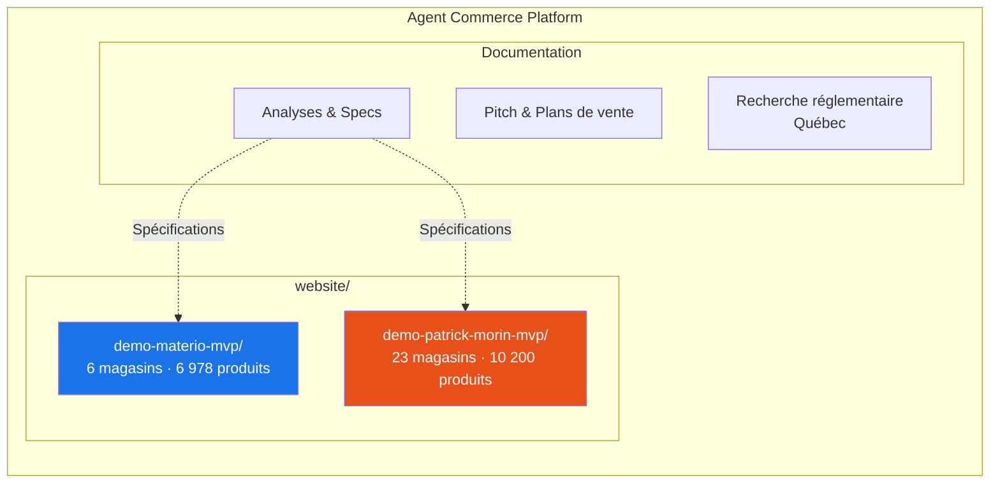
```mermaid
graph TB
    subgraph "Agent Commerce Platform"
        direction TB
        
        subgraph "Documentation"
            ANALYSE["Analyses & Specs"]
            PITCH["Pitch & Plans de vente"]
            RESEARCH["Recherche réglementaire<br/>Québec"]
        end

        subgraph "website/"
            MATERIO["demo-materio-mvp/<br/>6 magasins · 6 978 produits"]
            PM["demo-patrick-morin-mvp/<br/>23 magasins · 10 200 produits"]
        end
    end

    ANALYSE -.->|"Spécifications"| MATERIO
    ANALYSE -.->|"Spécifications"| PM

    style MATERIO fill:#1a73e8,color:#fff
    style PM fill:#e8501a,color:#fff
```

---

## 2. Stack technologique

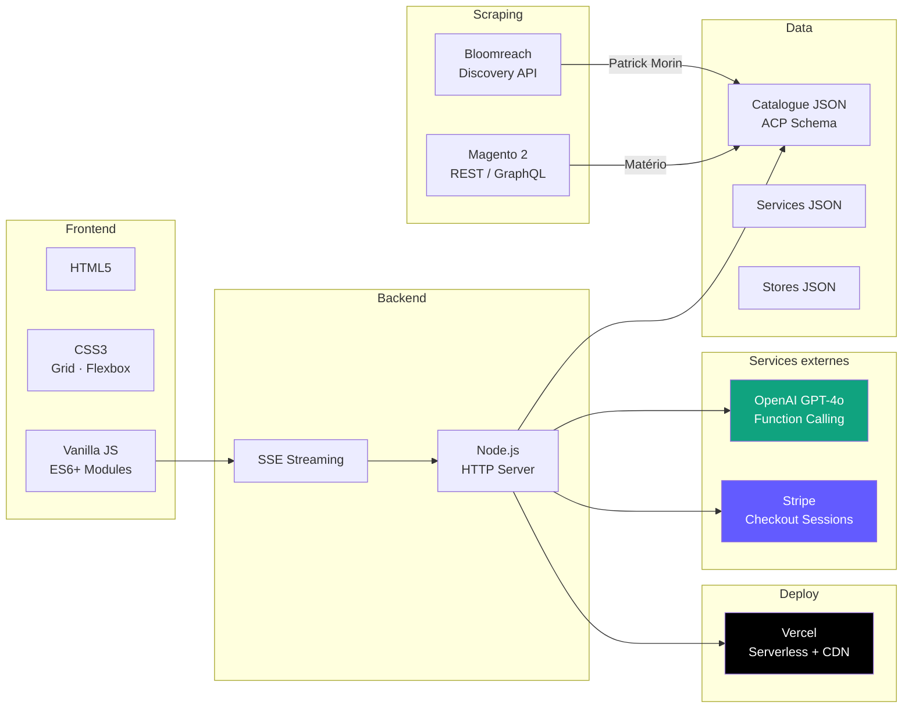
```mermaid
graph LR
    subgraph "Frontend"
        HTML["HTML5"]
        CSS["CSS3<br/>Grid · Flexbox"]
        JS["Vanilla JS<br/>ES6+ Modules"]
    end

    subgraph "Backend"
        NODE["Node.js<br/>HTTP Server"]
        SSE["SSE Streaming"]
    end

    subgraph "Services externes"
        OPENAI["OpenAI GPT-4o<br/>Function Calling"]
        STRIPE["Stripe<br/>Checkout Sessions"]
    end

    subgraph "Data"
        JSON_CAT["Catalogue JSON<br/>ACP Schema"]
        JSON_SVC["Services JSON"]
        JSON_STORES["Stores JSON"]
    end

    subgraph "Scraping"
        MAGENTO["Magento 2<br/>REST / GraphQL"]
        BLOOM["Bloomreach<br/>Discovery API"]
    end

    subgraph "Deploy"
        VERCEL["Vercel<br/>Serverless + CDN"]
    end

    JS --> SSE
    SSE --> NODE
    NODE --> OPENAI
    NODE --> STRIPE
    NODE --> JSON_CAT
    MAGENTO -->|"Matério"| JSON_CAT
    BLOOM -->|"Patrick Morin"| JSON_CAT
    NODE --> VERCEL

    style OPENAI fill:#10a37f,color:#fff
    style STRIPE fill:#635bff,color:#fff
    style VERCEL fill:#000,color:#fff
```

---

## 3. Architecture système

### 3.1 Architecture globale (commune aux deux démos)

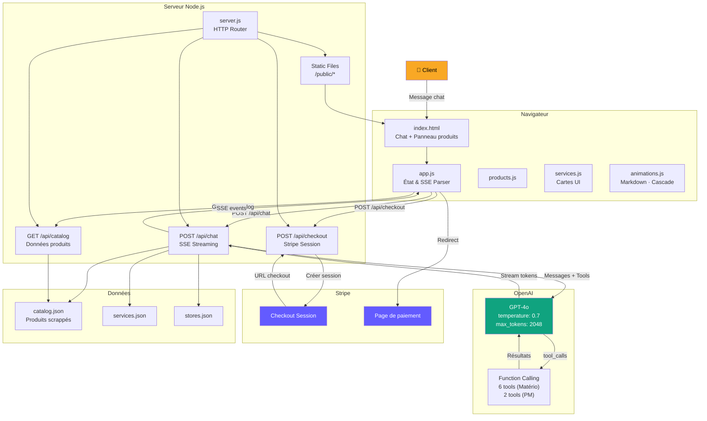
```mermaid
graph TB
    USER["👤 Client"]
    
    subgraph "Navigateur"
        UI["index.html<br/>Chat + Panneau produits"]
        APP_JS["app.js<br/>État & SSE Parser"]
        PROD_JS["products.js"]
        SVC_JS["services.js<br/>Cartes UI"]
        ANIM_JS["animations.js<br/>Markdown · Cascade"]
    end

    subgraph "Serveur Node.js"
        SERVER["server.js<br/>HTTP Router"]
        CHAT_API["POST /api/chat<br/>SSE Streaming"]
        CHECKOUT_API["POST /api/checkout<br/>Stripe Session"]
        CATALOG_API["GET /api/catalog<br/>Données produits"]
        STATIC["Static Files<br/>/public/*"]
    end

    subgraph "OpenAI"
        GPT["GPT-4o<br/>temperature: 0.7<br/>max_tokens: 2048"]
        TOOLS["Function Calling<br/>6 tools (Matério)<br/>2 tools (PM)"]
    end

    subgraph "Stripe"
        STRIPE_CO["Checkout Session"]
        STRIPE_PAY["Page de paiement"]
    end

    subgraph "Données"
        CATALOG["catalog.json<br/>Produits scrappés"]
        SERVICES["services.json"]
        STORES["stores.json"]
    end

    USER -->|"Message chat"| UI
    UI --> APP_JS
    APP_JS -->|"POST /api/chat"| CHAT_API
    APP_JS -->|"POST /api/checkout"| CHECKOUT_API
    APP_JS -->|"GET /api/catalog"| CATALOG_API

    CHAT_API -->|"Messages + Tools"| GPT
    GPT -->|"Stream tokens"| CHAT_API
    GPT -->|"tool_calls"| TOOLS
    TOOLS -->|"Résultats"| GPT
    
    CHAT_API -->|"SSE events"| APP_JS

    CHECKOUT_API -->|"Créer session"| STRIPE_CO
    STRIPE_CO -->|"URL checkout"| CHECKOUT_API
    APP_JS -->|"Redirect"| STRIPE_PAY

    CHAT_API --> CATALOG
    CHAT_API --> SERVICES
    CHAT_API --> STORES
    CATALOG_API --> CATALOG

    SERVER --> CHAT_API
    SERVER --> CHECKOUT_API
    SERVER --> CATALOG_API
    SERVER --> STATIC
    STATIC --> UI

    style GPT fill:#10a37f,color:#fff
    style STRIPE_CO fill:#635bff,color:#fff
    style STRIPE_PAY fill:#635bff,color:#fff
    style USER fill:#f9a825,color:#000
```

### 3.2 Événements SSE (Server-Sent Events)

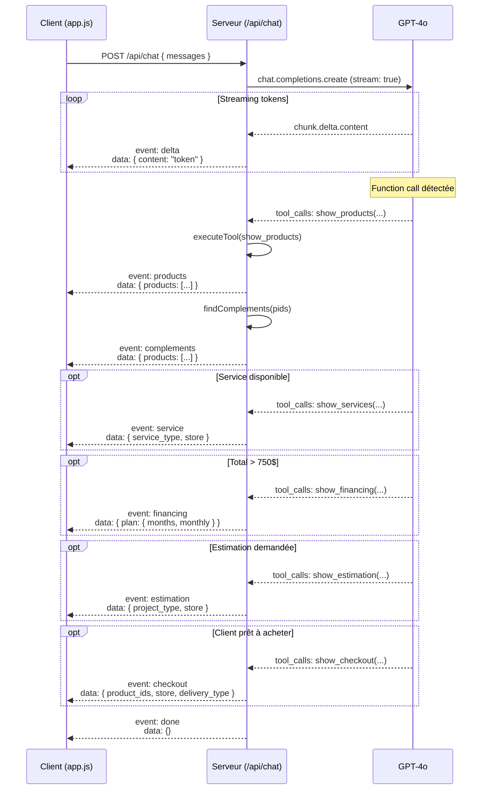
```mermaid
sequenceDiagram
    participant C as Client (app.js)
    participant S as Serveur (/api/chat)
    participant AI as GPT-4o

    C->>S: POST /api/chat { messages }
    S->>AI: chat.completions.create (stream: true)
    
    loop Streaming tokens
        AI-->>S: chunk.delta.content
        S-->>C: event: delta<br/>data: { content: "token" }
    end

    Note over AI: Function call détectée
    AI-->>S: tool_calls: show_products(...)
    S->>S: executeTool(show_products)
    S-->>C: event: products<br/>data: { products: [...] }
    
    S->>S: findComplements(pids)
    S-->>C: event: complements<br/>data: { products: [...] }

    opt Service disponible
        AI-->>S: tool_calls: show_services(...)
        S-->>C: event: service<br/>data: { service_type, store }
    end

    opt Total > 750$
        AI-->>S: tool_calls: show_financing(...)
        S-->>C: event: financing<br/>data: { plan: { months, monthly } }
    end

    opt Estimation demandée
        AI-->>S: tool_calls: show_estimation(...)
        S-->>C: event: estimation<br/>data: { project_type, store }
    end

    opt Client prêt à acheter
        AI-->>S: tool_calls: show_checkout(...)
        S-->>C: event: checkout<br/>data: { product_ids, store, delivery_type }
    end

    S-->>C: event: done<br/>data: {}
```

---

## 4. Architecture Matério MVP

### 4.1 Structure des fichiers

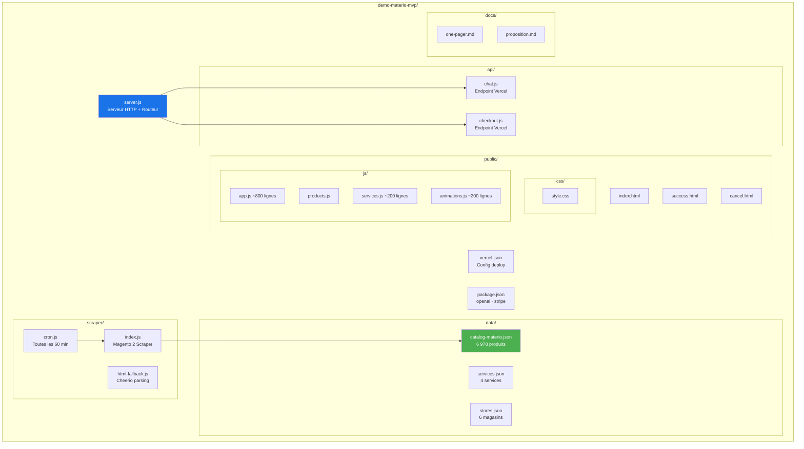
```mermaid
graph TD
    subgraph "demo-materio-mvp/"
        SERVER_JS["server.js<br/>Serveur HTTP + Routeur"]
        VERCEL_JSON["vercel.json<br/>Config deploy"]
        PKG["package.json<br/>openai · stripe"]
        
        subgraph "api/"
            CHAT["chat.js<br/>Endpoint Vercel"]
            CHECKOUT["checkout.js<br/>Endpoint Vercel"]
        end

        subgraph "data/"
            CAT_MAT["catalog-materio.json<br/>6 978 produits"]
            SVC_MAT["services.json<br/>4 services"]
            STORES_MAT["stores.json<br/>6 magasins"]
        end

        subgraph "public/"
            INDEX["index.html"]
            SUCCESS["success.html"]
            CANCEL["cancel.html"]
            subgraph "css/"
                STYLE["style.css"]
            end
            subgraph "js/"
                APP["app.js ~800 lignes"]
                PRODUCTS["products.js"]
                SERVICES_JS["services.js ~200 lignes"]
                ANIMATIONS["animations.js ~200 lignes"]
            end
        end

        subgraph "scraper/"
            SCRAPER_IDX["index.js<br/>Magento 2 Scraper"]
            SCRAPER_CRON["cron.js<br/>Toutes les 60 min"]
            SCRAPER_HTML["html-fallback.js<br/>Cheerio parsing"]
        end

        subgraph "docs/"
            ONEPAGER["one-pager.md"]
            PROPOSITION["proposition.md"]
        end
    end

    SERVER_JS --> CHAT
    SERVER_JS --> CHECKOUT
    SCRAPER_IDX --> CAT_MAT
    SCRAPER_CRON --> SCRAPER_IDX

    style CAT_MAT fill:#4caf50,color:#fff
    style SERVER_JS fill:#1a73e8,color:#fff
```

### 4.2 Function Calling — 6 outils GPT-4o

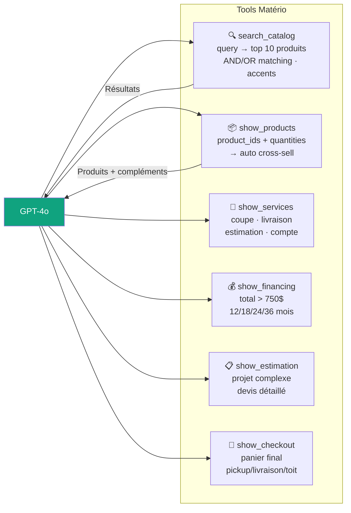
```mermaid
graph LR
    GPT["GPT-4o"]

    subgraph "Tools Matério"
        T1["🔍 search_catalog<br/>query → top 10 produits<br/>AND/OR matching · accents"]
        T2["📦 show_products<br/>product_ids + quantities<br/>→ auto cross-sell"]
        T3["🔧 show_services<br/>coupe · livraison<br/>estimation · compte"]
        T4["💰 show_financing<br/>total > 750$<br/>12/18/24/36 mois"]
        T5["📋 show_estimation<br/>projet complexe<br/>devis détaillé"]
        T6["🛒 show_checkout<br/>panier final<br/>pickup/livraison/toit"]
    end

    GPT --> T1
    GPT --> T2
    GPT --> T3
    GPT --> T4
    GPT --> T5
    GPT --> T6

    T1 -->|"Résultats"| GPT
    T2 -->|"Produits + compléments"| GPT

    style GPT fill:#10a37f,color:#fff
```

### 4.3 Scraper Matério — Stratégie 3 niveaux

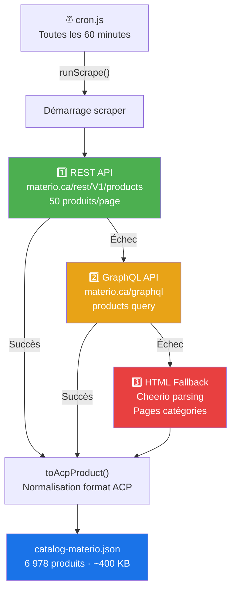
```mermaid
flowchart TD
    START["Démarrage scraper"]
    
    REST["1️⃣ REST API<br/>materio.ca/rest/V1/products<br/>50 produits/page"]
    GQL["2️⃣ GraphQL API<br/>materio.ca/graphql<br/>products query"]
    HTML["3️⃣ HTML Fallback<br/>Cheerio parsing<br/>Pages catégories"]
    
    TRANSFORM["toAcpProduct()<br/>Normalisation format ACP"]
    OUTPUT["catalog-materio.json<br/>6 978 produits · ~400 KB"]
    CRON["⏰ cron.js<br/>Toutes les 60 minutes"]

    START --> REST
    REST -->|"Succès"| TRANSFORM
    REST -->|"Échec"| GQL
    GQL -->|"Succès"| TRANSFORM
    GQL -->|"Échec"| HTML
    HTML --> TRANSFORM
    TRANSFORM --> OUTPUT
    CRON -->|"runScrape()"| START

    style REST fill:#4caf50,color:#fff
    style GQL fill:#e8a317,color:#fff
    style HTML fill:#e84040,color:#fff
    style OUTPUT fill:#1a73e8,color:#fff
```

---

## 5. Architecture Patrick Morin MVP

### 5.1 Différences clés vs Matério

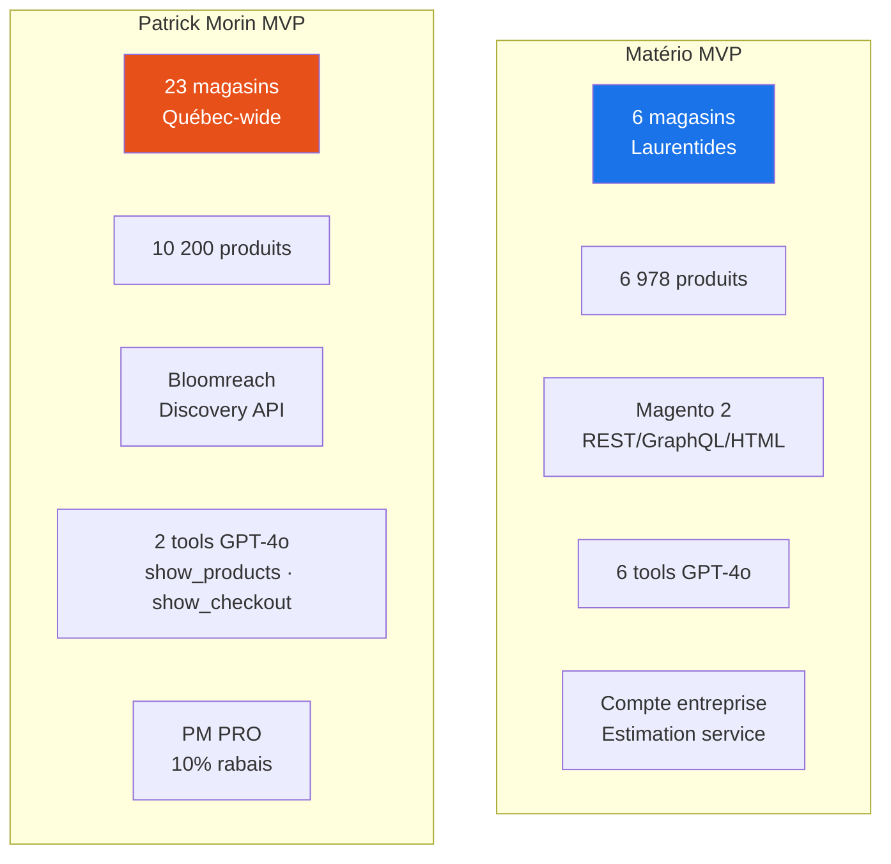
```mermaid
graph TB
    subgraph "Matério MVP"
        M_STORES["6 magasins<br/>Laurentides"]
        M_PRODS["6 978 produits"]
        M_SCRAPER["Magento 2<br/>REST/GraphQL/HTML"]
        M_TOOLS["6 tools GPT-4o"]
        M_B2B["Compte entreprise<br/>Estimation service"]
    end

    subgraph "Patrick Morin MVP"
        PM_STORES["23 magasins<br/>Québec-wide"]
        PM_PRODS["10 200 produits"]
        PM_SCRAPER["Bloomreach<br/>Discovery API"]
        PM_TOOLS["2 tools GPT-4o<br/>show_products · show_checkout"]
        PM_B2B["PM PRO<br/>10% rabais"]
    end

    style M_STORES fill:#1a73e8,color:#fff
    style PM_STORES fill:#e8501a,color:#fff
```

### 5.2 Scraper Patrick Morin — Bloomreach Discovery

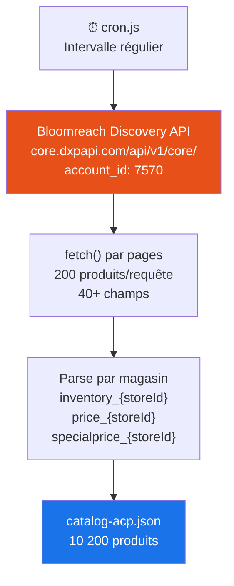
```mermaid
flowchart TD
    API["Bloomreach Discovery API<br/>core.dxpapi.com/api/v1/core/<br/>account_id: 7570"]
    
    FETCH["fetch() par pages<br/>200 produits/requête<br/>40+ champs"]
    
    PARSE["Parse par magasin<br/>inventory_{storeId}<br/>price_{storeId}<br/>specialprice_{storeId}"]
    
    OUTPUT["catalog-acp.json<br/>10 200 produits"]
    
    CRON["⏰ cron.js<br/>Intervalle régulier"]

    API --> FETCH
    FETCH --> PARSE
    PARSE --> OUTPUT
    CRON --> API

    style API fill:#e8501a,color:#fff
    style OUTPUT fill:#1a73e8,color:#fff
```

---

## 6. Flux applicatifs détaillés

### 6.1 Flux principal — Conversation agent IA

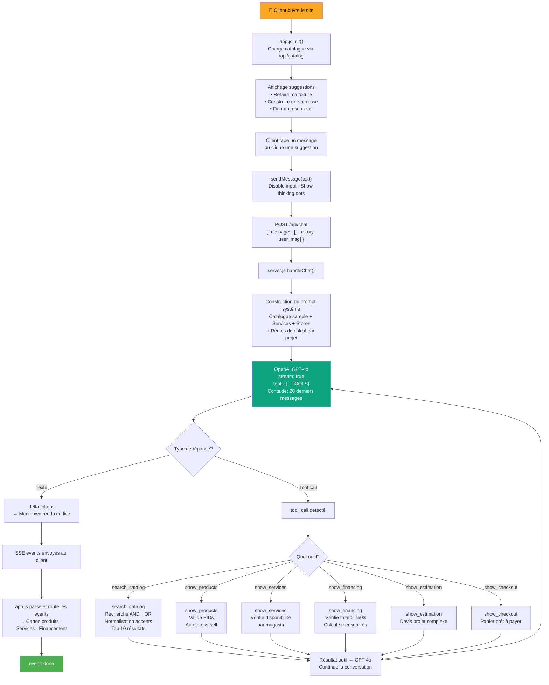
```mermaid
flowchart TD
    A["👤 Client ouvre le site"]
    B["app.js init()<br/>Charge catalogue via /api/catalog"]
    C["Affichage suggestions<br/>• Refaire ma toiture<br/>• Construire une terrasse<br/>• Finir mon sous-sol"]
    D["Client tape un message<br/>ou clique une suggestion"]
    E["sendMessage(text)<br/>Disable input · Show thinking dots"]
    F["POST /api/chat<br/>{ messages: [...history, user_msg] }"]
    
    G["server.js handleChat()"]
    H["Construction du prompt système<br/>Catalogue sample + Services + Stores<br/>+ Règles de calcul par projet"]
    I["OpenAI GPT-4o<br/>stream: true<br/>tools: [...TOOLS]<br/>Contexte: 20 derniers messages"]
    
    J{"Type de réponse?"}
    
    K1["delta tokens<br/>→ Markdown rendu en live"]
    K2["tool_call détecté"]
    
    L{"Quel outil?"}
    
    M1["search_catalog<br/>Recherche AND→OR<br/>Normalisation accents<br/>Top 10 résultats"]
    M2["show_products<br/>Valide PIDs<br/>Auto cross-sell"]
    M3["show_services<br/>Vérifie disponibilité<br/>par magasin"]
    M4["show_financing<br/>Vérifie total > 750$<br/>Calcule mensualités"]
    M5["show_estimation<br/>Devis projet complexe"]
    M6["show_checkout<br/>Panier prêt à payer"]
    
    N["Résultat outil → GPT-4o<br/>Continue la conversation"]
    
    O["SSE events envoyés au client"]
    P["app.js parse et route les events<br/>→ Cartes produits · Services · Financement"]
    Q["event: done"]

    A --> B --> C --> D --> E --> F --> G --> H --> I --> J
    J -->|"Texte"| K1 --> O
    J -->|"Tool call"| K2 --> L
    
    L -->|"search_catalog"| M1
    L -->|"show_products"| M2
    L -->|"show_services"| M3
    L -->|"show_financing"| M4
    L -->|"show_estimation"| M5
    L -->|"show_checkout"| M6
    
    M1 --> N
    M2 --> N
    M3 --> N
    M4 --> N
    M5 --> N
    M6 --> N
    N --> I
    
    O --> P --> Q

    style A fill:#f9a825,color:#000
    style I fill:#10a37f,color:#fff
    style Q fill:#4caf50,color:#fff
```

### 6.2 Flux recommandation produits et cross-sell

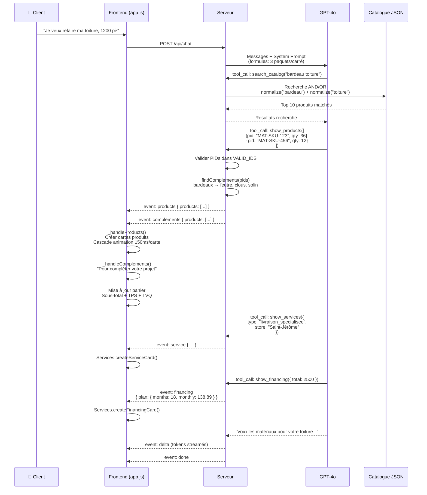
```mermaid
sequenceDiagram
    participant U as 👤 Client
    participant F as Frontend (app.js)
    participant S as Serveur
    participant AI as GPT-4o
    participant CAT as Catalogue JSON

    U->>F: "Je veux refaire ma toiture, 1200 pi²"
    F->>S: POST /api/chat

    S->>AI: Messages + System Prompt<br/>(formules: 3 paquets/carré)
    
    AI->>S: tool_call: search_catalog("bardeau toiture")
    S->>CAT: Recherche AND/OR<br/>normalize("bardeau") + normalize("toiture")
    CAT-->>S: Top 10 produits matchés
    S-->>AI: Résultats recherche

    AI->>S: tool_call: show_products([<br/>  {pid: "MAT-SKU-123", qty: 36},<br/>  {pid: "MAT-SKU-456", qty: 12}<br/>])
    
    S->>S: Valider PIDs dans VALID_IDS
    S->>S: findComplements(pids)<br/>bardeaux → feutre, clous, solin

    S-->>F: event: products { products: [...] }
    S-->>F: event: complements { products: [...] }
    
    F->>F: _handleProducts()<br/>Créer cartes produits<br/>Cascade animation 150ms/carte
    F->>F: _handleComplements()<br/>"Pour compléter votre projet"
    F->>F: Mise à jour panier<br/>Sous-total + TPS + TVQ

    AI->>S: tool_call: show_services({<br/>  type: "livraison_specialisee",<br/>  store: "Saint-Jérôme"<br/>})
    S-->>F: event: service { ... }
    F->>F: Services.createServiceCard()

    AI->>S: tool_call: show_financing({ total: 2500 })
    S-->>F: event: financing<br/>{ plan: { months: 18, monthly: 138.89 } }
    F->>F: Services.createFinancingCard()

    AI-->>S: "Voici les matériaux pour votre toiture..."
    S-->>F: event: delta (tokens streamés)
    S-->>F: event: done
```

### 6.3 Flux paiement Stripe

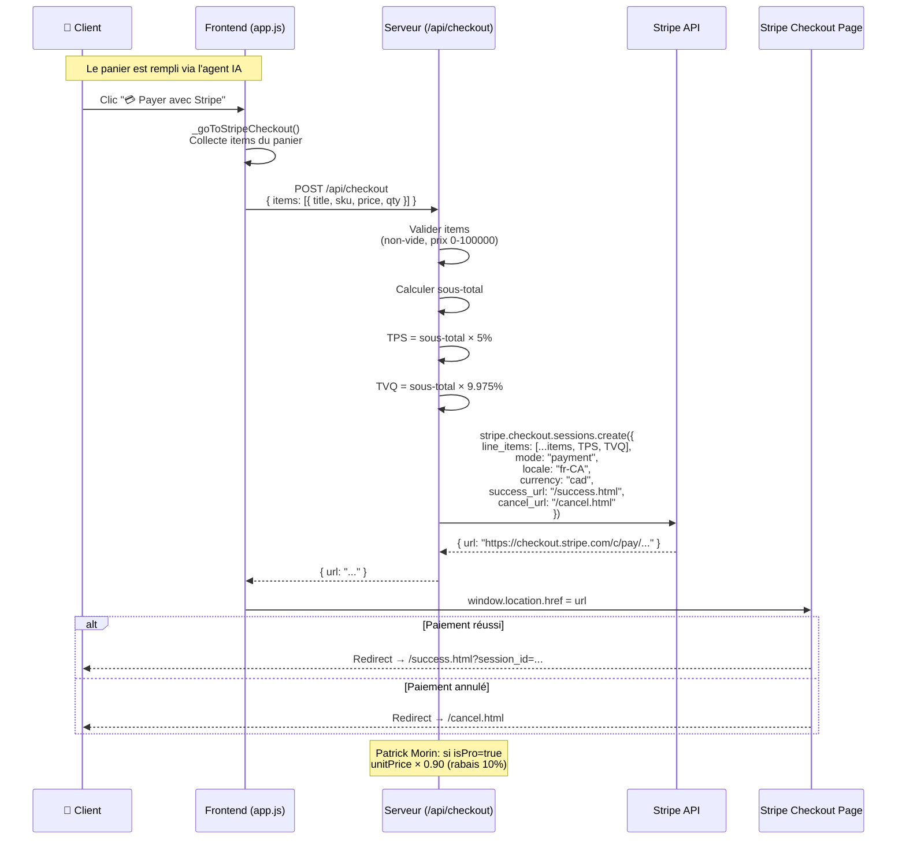
```mermaid
sequenceDiagram
    participant U as 👤 Client
    participant F as Frontend (app.js)
    participant S as Serveur (/api/checkout)
    participant ST as Stripe API
    participant SP as Stripe Checkout Page

    Note over U,F: Le panier est rempli via l'agent IA

    U->>F: Clic "💳 Payer avec Stripe"
    F->>F: _goToStripeCheckout()<br/>Collecte items du panier

    F->>S: POST /api/checkout<br/>{ items: [{ title, sku, price, qty }] }

    S->>S: Valider items<br/>(non-vide, prix 0-100000)
    S->>S: Calculer sous-total
    S->>S: TPS = sous-total × 5%
    S->>S: TVQ = sous-total × 9.975%
    
    S->>ST: stripe.checkout.sessions.create({<br/>  line_items: [...items, TPS, TVQ],<br/>  mode: "payment",<br/>  locale: "fr-CA",<br/>  currency: "cad",<br/>  success_url: "/success.html",<br/>  cancel_url: "/cancel.html"<br/>})

    ST-->>S: { url: "https://checkout.stripe.com/c/pay/..." }
    S-->>F: { url: "..." }
    
    F->>SP: window.location.href = url
    
    alt Paiement réussi
        SP-->>U: Redirect → /success.html?session_id=...
    else Paiement annulé
        SP-->>U: Redirect → /cancel.html
    end

    Note over S: Patrick Morin: si isPro=true<br/>unitPrice × 0.90 (rabais 10%)
```

### 6.4 Flux de recherche catalogue (Matério)

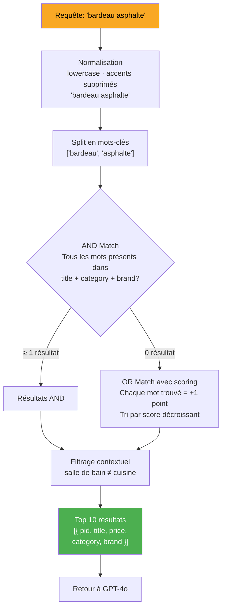
```mermaid
flowchart TD
    QUERY["Requête: 'bardeau asphalte'"]
    NORM["Normalisation<br/>lowercase · accents supprimés<br/>'bardeau asphalte'"]
    SPLIT["Split en mots-clés<br/>['bardeau', 'asphalte']"]
    
    AND_MATCH{"AND Match<br/>Tous les mots présents dans<br/>title + category + brand?"}
    
    AND_RESULTS["Résultats AND"]
    
    OR_MATCH["OR Match avec scoring<br/>Chaque mot trouvé = +1 point<br/>Tri par score décroissant"]
    
    CONTEXT["Filtrage contextuel<br/>salle de bain ≠ cuisine"]
    
    TOP10["Top 10 résultats<br/>[{ pid, title, price,<br/>category, brand }]"]
    
    RETURN["Retour à GPT-4o"]

    QUERY --> NORM --> SPLIT --> AND_MATCH
    AND_MATCH -->|"≥ 1 résultat"| AND_RESULTS --> CONTEXT
    AND_MATCH -->|"0 résultat"| OR_MATCH --> CONTEXT
    CONTEXT --> TOP10 --> RETURN

    style QUERY fill:#f9a825,color:#000
    style TOP10 fill:#4caf50,color:#fff
```

### 6.5 Flux services et financement

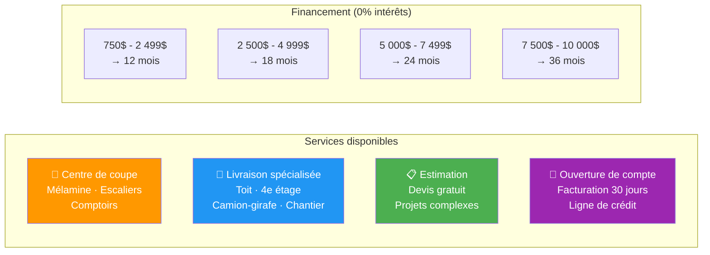
```mermaid
flowchart LR
    subgraph "Services disponibles"
        COUPE["🔧 Centre de coupe<br/>Mélamine · Escaliers<br/>Comptoirs"]
        LIVRAISON["🚚 Livraison spécialisée<br/>Toit · 4e étage<br/>Camion-girafe · Chantier"]
        ESTIMATION["📋 Estimation<br/>Devis gratuit<br/>Projets complexes"]
        COMPTE["📄 Ouverture de compte<br/>Facturation 30 jours<br/>Ligne de crédit"]
    end
    
    subgraph "Financement (0% intérêts)"
        F1["750$ - 2 499$<br/>→ 12 mois"]
        F2["2 500$ - 4 999$<br/>→ 18 mois"]
        F3["5 000$ - 7 499$<br/>→ 24 mois"]
        F4["7 500$ - 10 000$<br/>→ 36 mois"]
    end

    style COUPE fill:#ff9800,color:#fff
    style LIVRAISON fill:#2196f3,color:#fff
    style ESTIMATION fill:#4caf50,color:#fff
    style COMPTE fill:#9c27b0,color:#fff
```

---

## 7. Modèle de données

### 7.1 Schéma produit (format ACP)

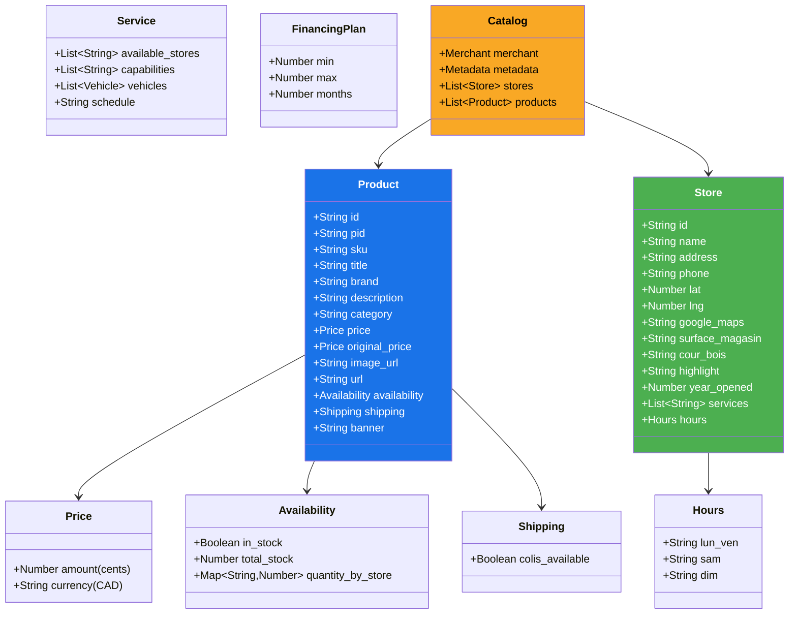
```mermaid
classDiagram
    class Product {
        +String id
        +String pid
        +String sku
        +String title
        +String brand
        +String description
        +String category
        +Price price
        +Price original_price
        +String image_url
        +String url
        +Availability availability
        +Shipping shipping
        +String banner
    }

    class Price {
        +Number amount (cents)
        +String currency (CAD)
    }

    class Availability {
        +Boolean in_stock
        +Number total_stock
        +Map~String,Number~ quantity_by_store
    }

    class Shipping {
        +Boolean colis_available
    }

    class Store {
        +String id
        +String name
        +String address
        +String phone
        +Number lat
        +Number lng
        +String google_maps
        +String surface_magasin
        +String cour_bois
        +String highlight
        +Number year_opened
        +List~String~ services
        +Hours hours
    }

    class Hours {
        +String lun_ven
        +String sam
        +String dim
    }

    class Service {
        +List~String~ available_stores
        +List~String~ capabilities
        +List~Vehicle~ vehicles
        +String schedule
    }

    class FinancingPlan {
        +Number min
        +Number max
        +Number months
    }

    class Catalog {
        +Merchant merchant
        +Metadata metadata
        +List~Store~ stores
        +List~Product~ products
    }

    Product --> Price
    Product --> Availability
    Product --> Shipping
    Store --> Hours
    Catalog --> Product
    Catalog --> Store

    style Product fill:#1a73e8,color:#fff
    style Store fill:#4caf50,color:#fff
    style Catalog fill:#f9a825,color:#000
```

### 7.2 État frontend (app.js)

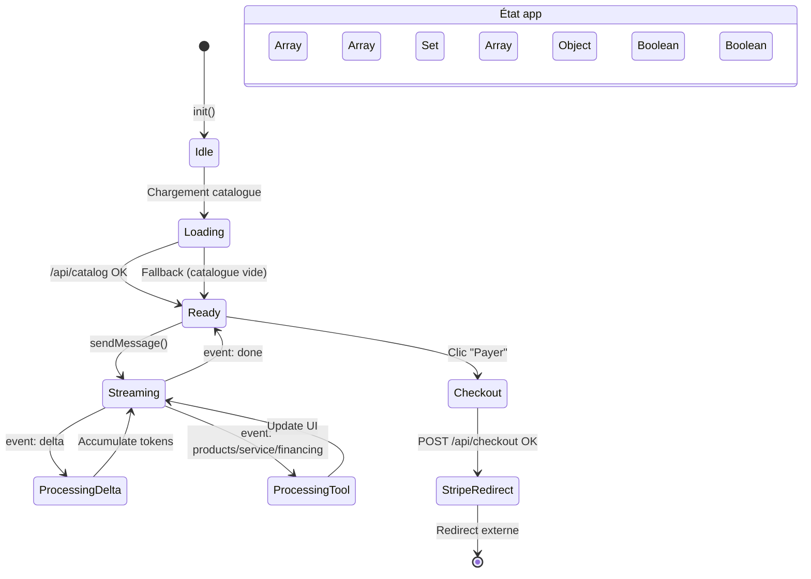
```mermaid
stateDiagram-v2
    [*] --> Idle: init()

    Idle --> Loading: Chargement catalogue
    Loading --> Ready: /api/catalog OK
    Loading --> Ready: Fallback (catalogue vide)
    
    Ready --> Streaming: sendMessage()
    
    Streaming --> ProcessingDelta: event: delta
    ProcessingDelta --> Streaming: Accumulate tokens
    
    Streaming --> ProcessingTool: event: products/service/financing
    ProcessingTool --> Streaming: Update UI
    
    Streaming --> Ready: event: done
    
    Ready --> Checkout: Clic "Payer"
    Checkout --> StripeRedirect: POST /api/checkout OK
    StripeRedirect --> [*]: Redirect externe

    state "État app" as AppState {
        messages: Array
        cart: Array
        displayedPids: Set
        activeServices: Array
        financingPlan: Object
        isStreaming: Boolean
        catalogLoaded: Boolean
    }
```

---

## 8. Déploiement Vercel

### 8.1 Architecture de déploiement

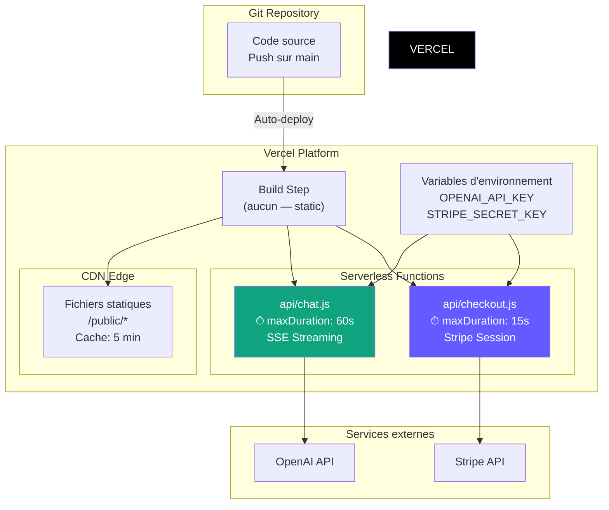
```mermaid
graph TB
    subgraph "Git Repository"
        CODE["Code source<br/>Push sur main"]
    end

    subgraph "Vercel Platform"
        BUILD["Build Step<br/>(aucun — static)"]
        
        subgraph "CDN Edge"
            STATIC["Fichiers statiques<br/>/public/*<br/>Cache: 5 min"]
        end

        subgraph "Serverless Functions"
            FN_CHAT["api/chat.js<br/>⏱ maxDuration: 60s<br/>SSE Streaming"]
            FN_CHECKOUT["api/checkout.js<br/>⏱ maxDuration: 15s<br/>Stripe Session"]
        end

        ENV["Variables d'environnement<br/>OPENAI_API_KEY<br/>STRIPE_SECRET_KEY"]
    end

    subgraph "Services externes"
        OPENAI_SVC["OpenAI API"]
        STRIPE_SVC["Stripe API"]
    end

    CODE -->|"Auto-deploy"| BUILD
    BUILD --> STATIC
    BUILD --> FN_CHAT
    BUILD --> FN_CHECKOUT
    
    ENV --> FN_CHAT
    ENV --> FN_CHECKOUT
    
    FN_CHAT --> OPENAI_SVC
    FN_CHECKOUT --> STRIPE_SVC

    style VERCEL fill:#000,color:#fff
    style FN_CHAT fill:#10a37f,color:#fff
    style FN_CHECKOUT fill:#635bff,color:#fff
```

### 8.2 Configuration Vercel (vercel.json)

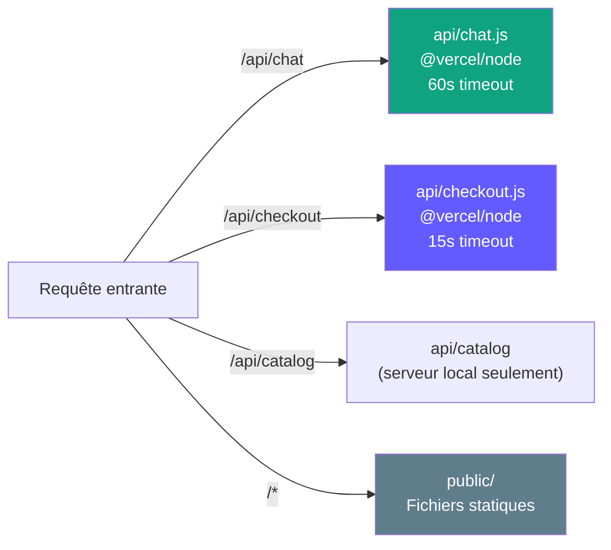
```mermaid
flowchart LR
    REQ["Requête entrante"]
    
    REQ -->|"/api/chat"| CHAT["api/chat.js<br/>@vercel/node<br/>60s timeout"]
    REQ -->|"/api/checkout"| CHECKOUT["api/checkout.js<br/>@vercel/node<br/>15s timeout"]
    REQ -->|"/api/catalog"| CATALOG["api/catalog<br/>(serveur local seulement)"]
    REQ -->|"/*"| STATIC["public/<br/>Fichiers statiques"]

    style CHAT fill:#10a37f,color:#fff
    style CHECKOUT fill:#635bff,color:#fff
    style STATIC fill:#607d8b,color:#fff
```

---

## Variables d'environnement requises

| Variable | Description | Utilisée par |
|---|---|---|
| `OPENAI_API_KEY` | Clé API OpenAI (sk-proj-...) | `/api/chat` |
| `STRIPE_SECRET_KEY` | Clé secrète Stripe (sk_test_...) | `/api/checkout` |
| `PORT` | Port du serveur local (défaut: 3000) | `server.js` |

---

## 9. Prompt Engineering

Le prompt engineering est au cœur du système. Il orchestre les réponses de GPT-4o en lui donnant l'identité du marchand, les règles métier, le catalogue produits et des outils (function calling) pour interagir avec le frontend.

### 9.1 Vue d'ensemble — Construction du prompt système

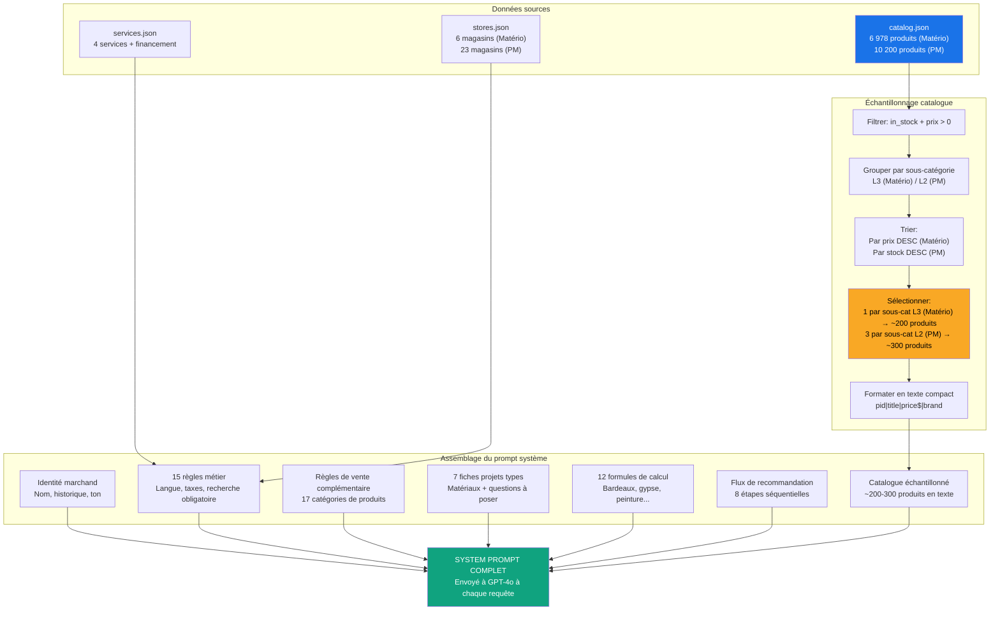
```mermaid
flowchart TD
    subgraph "Données sources"
        CAT["catalog.json<br/>6 978 produits (Matério)<br/>10 200 produits (PM)"]
        SVC["services.json<br/>4 services + financement"]
        STORES["stores.json<br/>6 magasins (Matério)<br/>23 magasins (PM)"]
    end

    subgraph "Échantillonnage catalogue"
        FILTER["Filtrer: in_stock + prix > 0"]
        GROUP["Grouper par sous-catégorie<br/>L3 (Matério) / L2 (PM)"]
        SORT["Trier:<br/>Par prix DESC (Matério)<br/>Par stock DESC (PM)"]
        SELECT["Sélectionner:<br/>1 par sous-cat L3 (Matério) → ~200 produits<br/>3 par sous-cat L2 (PM) → ~300 produits"]
        FORMAT["Formater en texte compact<br/>pid|title|price$|brand"]
    end

    subgraph "Assemblage du prompt système"
        IDENTITY["Identité marchand<br/>Nom, historique, ton"]
        RULES["15 règles métier<br/>Langue, taxes, recherche obligatoire"]
        CROSSSELL["Règles de vente complémentaire<br/>17 catégories de produits"]
        PROJECTS["7 fiches projets types<br/>Matériaux + questions à poser"]
        FORMULAS["12 formules de calcul<br/>Bardeaux, gypse, peinture..."]
        WORKFLOW["Flux de recommandation<br/>8 étapes séquentielles"]
        CATALOG_TXT["Catalogue échantillonné<br/>~200-300 produits en texte"]
    end

    SYSTEM["SYSTEM PROMPT COMPLET<br/>Envoyé à GPT-4o à chaque requête"]

    CAT --> FILTER --> GROUP --> SORT --> SELECT --> FORMAT --> CATALOG_TXT
    SVC --> RULES
    STORES --> RULES
    IDENTITY --> SYSTEM
    RULES --> SYSTEM
    CROSSSELL --> SYSTEM
    PROJECTS --> SYSTEM
    FORMULAS --> SYSTEM
    WORKFLOW --> SYSTEM
    CATALOG_TXT --> SYSTEM

    style SYSTEM fill:#10a37f,color:#fff
    style CAT fill:#1a73e8,color:#fff
    style SELECT fill:#f9a825,color:#000
```

### 9.2 Anatomie du prompt système

Le prompt est composé de 7 blocs assemblés dynamiquement :

```mermaid
graph TD
    subgraph "Prompt système (~3000+ tokens)"
        direction TB
        
        B1["🏪 BLOC 1 — Identité<br/>─────────────────<br/>Tu es l'assistant commercial IA de Matério,<br/>une chaîne de centres de rénovation dans les<br/>Laurentides au Québec fondée en 1979...<br/>6 magasins · Groupe ILDC (4G$)"]
        
        B2["📋 BLOC 2 — 15 Règles métier<br/>─────────────────<br/>1. Français québécois, ton chaleureux<br/>2. UNIQUEMENT les produits du catalogue<br/>3. Calculer les quantités<br/>6. TPS 5% + TVQ 9.975%<br/>7. ⚠️ RÈGLE CRITIQUE: search_catalog<br/>   obligatoire avant de recommander<br/>14. Catalogue = N produits<br/>15. Ne JAMAIS dire indisponible"]
        
        B3["🔄 BLOC 3 — Vente complémentaire<br/>─────────────────<br/>17 catégories de cross-sell:<br/>Bardeaux → feutre, clous, solin...<br/>Peinture → rouleau, pinceau, ruban...<br/>Gypse → vis, ruban joints, composé...<br/>Céramique → mortier, coulis, croisillons..."]
        
        B4["🏠 BLOC 4 — 7 Projets types<br/>─────────────────<br/>🏠 Toiture: structure + couverture + ventilation<br/>🪵 Terrasse: structure + surface + fixation<br/>🧱 Sous-sol: ossature + isolation + revêtement<br/>🚿 Salle de bain: plomberie + murs + plancher<br/>🏗️ Cabanon: fondation + structure + toiture<br/>🪜 Clôture: poteaux + structure + revêtement<br/>🎨 Peinture: peinture + outils + protection"]
        
        B5["📐 BLOC 5 — 12 Formules de calcul<br/>─────────────────<br/>Bardeaux: 3 paquets/carré (100pi²) + 10%<br/>Gypse 4×8: (périmètre × h) ÷ 32 pi²<br/>Peinture: 1 gallon = 350-400 pi², 2 couches<br/>Vis à gypse: ~300/1000 pi²<br/>Solives: longueur ÷ 1.33 + 1"]
        
        B6["🔀 BLOC 6 — Flux de recommandation<br/>─────────────────<br/>1. Identifier le type de projet<br/>2. Appeler search_catalog (2-4 catégories)<br/>3. Calculer les quantités<br/>4. Appeler show_products<br/>5. Présenter en 3 sections<br/>6. Questions APRÈS les produits<br/>7. Totaliser + financement si > 750$<br/>8. Proposer services pertinents"]
        
        B7["📦 BLOC 7 — Catalogue échantillonné<br/>─────────────────<br/>~200 produits (1 par sous-catégorie L3)<br/>Format: pid|titre|prix$|marque<br/><br/>BOIS - CONSTRUCTION:<br/>MAT-SKU-123|Bois 2×4 8'|5.99$|Canfor<br/>MAT-SKU-456|Bois 2×6 8'|7.99$|Canfor<br/><br/>TOITURE - BARDEAUX:<br/>MAT-SKU-789|Bardeau Dakota 25 ans|49.99$|Dakota"]
        
        B1 --> B2 --> B3 --> B4 --> B5 --> B6 --> B7
    end

    style B1 fill:#1a73e8,color:#fff
    style B2 fill:#e84040,color:#fff
    style B3 fill:#ff9800,color:#fff
    style B4 fill:#4caf50,color:#fff
    style B5 fill:#9c27b0,color:#fff
    style B6 fill:#00bcd4,color:#fff
    style B7 fill:#607d8b,color:#fff
```

### 9.3 Stratégie d'échantillonnage du catalogue

Le catalogue complet (~7000-10000 produits) ne peut pas être injecté dans le prompt. Une stratégie d'échantillonnage sélectionne les produits représentatifs.

```mermaid
flowchart TD
    subgraph "Matério — 1 produit par sous-catégorie L3"
        M_IN["6 978 produits"]
        M_FILTER["Filtrer: in_stock=true<br/>price > 0"]
        M_GROUP["Grouper par catégorie L3<br/>ex: Bois > Construction > 2×4"]
        M_SORT["Trier par prix DESC<br/>(produit premium en premier)"]
        M_PICK["Prendre le 1er de chaque<br/>sous-catégorie L3"]
        M_OUT["~200 produits dans le prompt"]
        M_FORMAT["Format compact:<br/>MAT-SKU-123|Titre|49.99$|Marque"]
        
        M_IN --> M_FILTER --> M_GROUP --> M_SORT --> M_PICK --> M_FORMAT --> M_OUT
    end

    subgraph "Patrick Morin — 3 produits par sous-catégorie L2"
        PM_IN["10 200 produits"]
        PM_FILTER["Filtrer: in_stock=true<br/>price > 0"]
        PM_GROUP["Grouper par catégorie L2<br/>ex: Bois > Construction"]
        PM_SORT["Trier par stock DESC<br/>(plus populaire en premier)"]
        PM_PICK["Prendre les 3 premiers<br/>de chaque sous-catégorie L2"]
        PM_OUT["~300 produits dans le prompt"]
        PM_FORMAT["Format:<br/>- PM-SKU: Titre | 49.99$ (rég. 59.99$) | Laval:45 | Marque"]
        
        PM_IN --> PM_FILTER --> PM_GROUP --> PM_SORT --> PM_PICK --> PM_FORMAT --> PM_OUT
    end

    style M_OUT fill:#1a73e8,color:#fff
    style PM_OUT fill:#e8501a,color:#fff
    style M_SORT fill:#f9a825,color:#000
    style PM_SORT fill:#f9a825,color:#000
```

**Différence clé** : Matério trie par **prix décroissant** (montre les produits premium d'abord), Patrick Morin trie par **stock décroissant** (montre les produits les plus disponibles).

### 9.4 Function Calling — Les outils GPT-4o

Les outils permettent au modèle d'exécuter des actions côté serveur et de déclencher des événements SSE dans le frontend.

```mermaid
graph TB
    subgraph "GPT-4o reçoit"
        PROMPT["System prompt<br/>+ Messages utilisateur<br/>+ Définitions d'outils"]
    end

    subgraph "Outils Matério (6)"
        direction LR
        SEARCH["🔍 search_catalog<br/>────────────<br/>Params: query (string)<br/>Retourne: top 10 produits<br/>{pid, title, price, category}<br/>────────────<br/>Algo: AND → OR fallback<br/>Context filter: bain ≠ cuisine<br/>Accent normalization"]
        
        SHOW["📦 show_products<br/>────────────<br/>Params: products[]<br/>{product_id, quantity}<br/>────────────<br/>Auto cross-sell via<br/>findComplements()<br/>Max 6 compléments"]
        
        SERVICE["🔧 show_services<br/>────────────<br/>Params: service_type (enum)<br/>centre_de_coupe |<br/>livraison_specialisee |<br/>estimation |<br/>ouverture_compte<br/>+ store, details"]
        
        FINANCE["💰 show_financing<br/>────────────<br/>Params: total_amount<br/>Trigger: > 750$<br/>Plans: 12/18/24/36 mois<br/>0% intérêts"]
        
        ESTIM["📋 show_estimation<br/>────────────<br/>Params: project_type,<br/>project_details{},<br/>store, estimated_range"]

        CHECKOUT_T["🛒 show_checkout<br/>────────────<br/>Params: product_ids[],<br/>store, delivery_type<br/>(pickup|standard|toit|chantier)<br/>financing, account_number"]
    end

    subgraph "Outils Patrick Morin (2)"
        PM_SHOW["📦 show_products<br/>────────────<br/>Même que Matério"]
        PM_CHECKOUT["🛒 show_checkout<br/>────────────<br/>Params: is_pro (bool)<br/>store, delivery_method<br/>(pickup|delivery)"]
    end

    PROMPT --> SEARCH
    PROMPT --> SHOW
    PROMPT --> SERVICE
    PROMPT --> FINANCE
    PROMPT --> ESTIM
    PROMPT --> CHECKOUT_T

    style SEARCH fill:#4caf50,color:#fff
    style SHOW fill:#1a73e8,color:#fff
    style CHECKOUT_T fill:#635bff,color:#fff
    style FINANCE fill:#f9a825,color:#000
```

### 9.5 Boucle itérative de tool calling (Matério)

Matério implémente une boucle multi-tour qui force GPT-4o à chercher PUIS montrer des produits, au lieu de répondre en texte seul.

```mermaid
flowchart TD
    START["Requête utilisateur reçue"]
    
    DETECT{"needsSearch?<br/>40+ mots-clés détectés<br/>(toiture|terrasse|peintur|je veux<br/>|refaire|construire|bardeau...)"}
    
    R1["🔄 ROUND 1<br/>tool_choice: FORCÉ → search_catalog<br/>GPT-4o DOIT chercher dans le catalogue"]
    
    R1_EXEC["Exécuter search_catalog<br/>Retourne: top 10 produits<br/>+ message 'Tu DOIS appeler show_products'"]
    
    R2{"Round 2-4<br/>tool_choice: auto<br/>GPT-4o choisit librement"}
    
    R2_SEARCH["GPT-4o appelle search_catalog<br/>(autres mots-clés)"]
    R2_SHOW["GPT-4o appelle show_products<br/>avec les pid trouvés"]
    R2_OTHER["GPT-4o appelle<br/>show_services / show_financing"]
    
    FORCE_SHOW{"≥ 2 recherches effectuées<br/>+ résultats trouvés<br/>+ pas encore de produits montrés?"}
    
    R_FORCE["ROUND N<br/>tool_choice: FORCÉ → show_products<br/>GPT-4o DOIT montrer des produits"]
    
    SSE_PRODUCTS["📦 SSE: event products<br/>🔄 SSE: event complements<br/>(auto cross-sell)"]
    
    FINAL["ROUND FINAL<br/>Appel GPT-4o SANS outils<br/>→ Génère le texte explicatif"]
    
    SSE_DELTA["💬 SSE: event delta<br/>(tokens streamés)"]
    
    DONE["✅ SSE: event done"]
    
    AUTO["🔄 ROUND 1<br/>tool_choice: auto<br/>GPT-4o choisit librement"]

    START --> DETECT
    DETECT -->|"Oui"| R1
    DETECT -->|"Non"| AUTO
    AUTO --> R2
    R1 --> R1_EXEC --> R2
    
    R2 -->|"search"| R2_SEARCH --> FORCE_SHOW
    R2 -->|"show_products"| R2_SHOW --> SSE_PRODUCTS
    R2 -->|"autre outil"| R2_OTHER --> R2
    R2 -->|"pas d'outil (texte)"| FINAL
    
    FORCE_SHOW -->|"Oui"| R_FORCE --> SSE_PRODUCTS
    FORCE_SHOW -->|"Non"| R2
    
    SSE_PRODUCTS --> FINAL
    FINAL --> SSE_DELTA --> DONE

    style R1 fill:#e84040,color:#fff
    style R_FORCE fill:#e84040,color:#fff
    style SSE_PRODUCTS fill:#1a73e8,color:#fff
    style DONE fill:#4caf50,color:#fff
    style DETECT fill:#f9a825,color:#000
```

**Logique clé** : Le système force `search_catalog` au round 1 si des mots-clés de projet sont détectés (40+ patterns regex). Après ≥2 recherches avec résultats, il force `show_products` pour garantir l'affichage de cartes produits.

**Maximum 5 rounds** pour éviter les boucles infinies.

### 9.6 Algorithme de recherche catalogue

```mermaid
flowchart TD
    QUERY["Requête: 'bardeau asphalte'"]
    
    NORM["1. Normalisation Unicode<br/>lowercase + supprimer accents<br/>NFD + remove diacritics<br/>'bardeau asphalte'"]
    
    SPLIT["2. Split en mots-clés<br/>Filtrer mots < 2 chars<br/>→ ['bardeau', 'asphalte']"]
    
    CTX{"3. Détection du contexte<br/>salle|bain|douche → bathroom<br/>cuisine → kitchen"}
    
    AND{"4. AND Match<br/>Tous les mots présents dans<br/>title + category + brand?"}
    
    AND_YES["Résultats trouvés"]
    
    OR["5. OR Match (fallback)<br/>Score = nombre de mots trouvés<br/>Trier par score DESC"]
    
    CTX_FILTER["6. Filtre contextuel<br/>Si bathroom: exclure cuisine<br/>Si kitchen: exclure salle de bain"]
    
    TOP10["7. Prendre top 10<br/>Retourner: pid, title, price,<br/>category, brand"]
    
    NEXT_STEP{"8. Message de guidage<br/>pour GPT-4o"}
    
    MSG_OK["'N produit(s) trouvé(s).<br/>Tu DOIS appeler show_products<br/>avec les pid ci-dessus.'"]
    MSG_FAIL["'Aucun résultat. Essaie avec<br/>des mots-clés plus courts.'"]

    QUERY --> NORM --> SPLIT --> CTX --> AND
    AND -->|"≥ 1 résultat"| AND_YES --> CTX_FILTER
    AND -->|"0 résultat"| OR --> CTX_FILTER
    CTX_FILTER --> TOP10 --> NEXT_STEP
    NEXT_STEP -->|"Résultats"| MSG_OK
    NEXT_STEP -->|"Aucun"| MSG_FAIL

    style QUERY fill:#f9a825,color:#000
    style AND fill:#4caf50,color:#fff
    style OR fill:#ff9800,color:#fff
    style TOP10 fill:#1a73e8,color:#fff
```

### 9.7 Cross-sell automatique — findComplements()

Quand `show_products` est appelé, le système génère automatiquement des produits complémentaires.

```mermaid
flowchart TD
    PIDS["Produits recommandés<br/>[MAT-SKU-123, MAT-SKU-456]"]
    
    TEXT["Extraire titre + catégorie<br/>de chaque produit<br/>Normaliser (lowercase, accents)"]
    
    MAP["Parcourir COMPLEMENT_MAP<br/>(17 catégories de cross-sell)"]
    
    subgraph "COMPLEMENT_MAP (exemples)"
        C1["bardeau|toiture|shingle<br/>→ clou toiture, papier feutre,<br/>solin, évent toit, sous-couche"]
        C2["peinture<br/>→ rouleau, pinceau,<br/>ruban peintre, bâche, apprêt"]
        C3["gypse|placoplâtre<br/>→ vis gypse, ruban joints,<br/>composé joints, couteau"]
        C4["céramique|carrelage|tuile<br/>→ mortier-colle, coulis,<br/>croisillons, truelle dentelée"]
        CDOTS["... 13 autres catégories"]
    end
    
    MATCH{"Mots-clés du produit<br/>matchent une catégorie?"}
    
    SEARCH_COMP["Chercher chaque terme<br/>complémentaire dans le catalogue<br/>(AND matching)"]
    
    DEDUP["Dédupliquer<br/>(exclure produits déjà recommandés)"]
    
    LIMIT["Limiter à 6 compléments"]
    
    SSE["SSE event: complements<br/>{ products: [{product_id, qty:1}] }"]
    
    FRONTEND["Frontend: section<br/>'Pour compléter votre projet'"]

    PIDS --> TEXT --> MAP
    MAP --> C1 & C2 & C3 & C4
    C1 & C2 & C3 & C4 --> MATCH
    MATCH -->|"Oui"| SEARCH_COMP --> DEDUP --> LIMIT --> SSE --> FRONTEND
    MATCH -->|"Non"| NOTHING["Pas de compléments"]

    style C1 fill:#ff9800,color:#fff
    style C2 fill:#ff9800,color:#fff
    style C3 fill:#ff9800,color:#fff
    style C4 fill:#ff9800,color:#fff
    style SSE fill:#1a73e8,color:#fff
```

### 9.8 Comparaison des configs modèle

```mermaid
graph LR
    subgraph "Matério"
        M_MODEL["Modèle: gpt-4o-mini"]
        M_TEMP["Temperature: 0.4<br/>(stable, calculs précis)"]
        M_TOKENS["Max tokens: 2048"]
        M_TOOLS_N["6 outils"]
        M_LOOP["Boucle itérative<br/>Max 5 rounds<br/>Tool forcing dynamique"]
        M_SEARCH_T["search_catalog intégré<br/>AND/OR + context filter"]
    end

    subgraph "Patrick Morin"
        PM_MODEL["Modèle: gpt-4o"]
        PM_TEMP["Temperature: 0.4"]
        PM_TOKENS["Max tokens: 2048"]
        PM_TOOLS_N["2 outils"]
        PM_LOOP["Pas de boucle itérative<br/>1 seul round"]
        PM_SEARCH_T["Pas de search_catalog<br/>Catalogue statique dans prompt"]
    end

    style M_MODEL fill:#4caf50,color:#fff
    style PM_MODEL fill:#1a73e8,color:#fff
    style M_LOOP fill:#e84040,color:#fff
    style M_SEARCH_T fill:#4caf50,color:#fff
```

### 9.9 Flux complet — Du message au rendu

```mermaid
sequenceDiagram
    participant U as 👤 Client
    participant F as Frontend
    participant S as Serveur
    participant AI as GPT-4o
    participant CAT as Catalogue

    U->>F: "Je veux construire une terrasse 12×16"
    F->>S: POST /api/chat { messages }

    Note over S: Construction du prompt système
    S->>S: 1. Charger catalogue (~200 produits échantillonnés)
    S->>S: 2. Injecter services + magasins
    S->>S: 3. Assembler: identité + règles + projets<br/>+ formules + cross-sell + catalogue

    Note over S: Détection: "construire" + "terrasse" → needsSearch=true
    
    rect rgb(255, 200, 200)
        Note over S,AI: ROUND 1 — tool_choice FORCÉ: search_catalog
        S->>AI: system + user messages<br/>tool_choice: {function: "search_catalog"}
        AI->>S: tool_call: search_catalog("bois traité terrasse")
        S->>CAT: AND match: ["bois", "traite", "terrasse"]
        CAT-->>S: 8 produits trouvés
        S-->>AI: tool result: {results: [...], next_step: "DOIS appeler show_products"}
    end

    rect rgb(200, 255, 200)
        Note over S,AI: ROUND 2 — tool_choice: auto
        S->>AI: Messages + tool results
        AI->>S: tool_call: search_catalog("vis terrasse inox")
        S->>CAT: AND match: ["vis", "terrasse"]
        CAT-->>S: 5 produits trouvés
        S-->>AI: tool result: {results: [...]}
    end

    rect rgb(200, 200, 255)
        Note over S,AI: ROUND 3 — tool_choice: auto
        AI->>S: tool_call: show_products([<br/>  {pid: "MAT-BT-2x8", qty: 12},<br/>  {pid: "MAT-PLT-5/4", qty: 45},<br/>  {pid: "MAT-VIS-3", qty: 4}<br/>])
        S->>S: Valider PIDs dans VALID_IDS
        S->>S: findComplements() → teinture, ancrage, solin
        S-->>F: event: products {products: [...]}
        S-->>F: event: complements {products: [...]}
        S-->>AI: "3 produits affichés + 3 compléments"
    end

    rect rgb(255, 255, 200)
        Note over S,AI: ROUND 4 — tool_choice: auto
        AI->>S: tool_call: show_financing({total: 2800})
        S->>S: Plan: 2500-4999 → 18 mois
        S-->>F: event: financing {plan: {months: 18, monthly: 155.56}}
        AI->>S: tool_call: show_services({type: "livraison_specialisee"})
        S-->>F: event: service {service_type, store}
    end

    rect rgb(230, 230, 230)
        Note over S,AI: ROUND FINAL — Texte uniquement (pas d'outils)
        S->>AI: Messages complets (SANS outils)
        AI-->>S: stream: "Excellent choix! Voici les matériaux<br/>pour votre terrasse 12×16..."
        S-->>F: event: delta (token par token)
        S-->>F: event: done
    end

    F->>F: Rendu markdown + cartes produits<br/>+ cartes services + financement
    F->>U: Affichage complet du projet
```

### 9.10 Optimisations appliquées

```mermaid
graph TD
    subgraph "Avant optimisation"
        OLD_TEMP["Temperature: 0.7<br/>→ Calculs inconsistants"]
        OLD_TOKENS["Max tokens: 1024<br/>→ Réponses tronquées"]
        OLD_SEARCH["Pas de search_catalog<br/>→ Hallucination de produits"]
        OLD_CROSSSELL["7 catégories cross-sell<br/>→ Vente complémentaire limitée"]
        OLD_FLOW["Pas de workflow imposé<br/>→ Réponses texte sans produits"]
    end

    subgraph "Après optimisation"
        NEW_TEMP["Temperature: 0.4<br/>→ Calculs stables + ton naturel"]
        NEW_TOKENS["Max tokens: 2048<br/>→ Projets complexes complets"]
        NEW_SEARCH["search_catalog obligatoire<br/>→ Produits réels du catalogue"]
        NEW_CROSSSELL["17 catégories cross-sell<br/>→ Panier moyen augmenté"]
        NEW_FLOW["Workflow 8 étapes + tool forcing<br/>→ Toujours des cartes produits"]
    end

    OLD_TEMP -->|"Optimisé"| NEW_TEMP
    OLD_TOKENS -->|"Doublé"| NEW_TOKENS
    OLD_SEARCH -->|"Ajouté"| NEW_SEARCH
    OLD_CROSSSELL -->|"Étendu"| NEW_CROSSSELL
    OLD_FLOW -->|"Structuré"| NEW_FLOW

    style OLD_TEMP fill:#e84040,color:#fff
    style OLD_TOKENS fill:#e84040,color:#fff
    style OLD_SEARCH fill:#e84040,color:#fff
    style NEW_TEMP fill:#4caf50,color:#fff
    style NEW_TOKENS fill:#4caf50,color:#fff
    style NEW_SEARCH fill:#4caf50,color:#fff
    style NEW_FLOW fill:#4caf50,color:#fff
```

---

## Résumé des événements SSE

| Événement | Données | Déclencheur | Handler Frontend |
|---|---|---|---|
| `delta` | `{ content: "token" }` | Chaque token GPT-4o | Accumulation markdown |
| `products` | `{ products: [{ product_id, quantity }] }` | `show_products()` | `_handleProducts()` |
| `complements` | `{ products: [...] }` | Auto cross-sell | `_handleComplements()` |
| `service` | `{ service_type, store, details }` | `show_services()` | `_handleService()` |
| `financing` | `{ plan: { months, monthly, total } }` | `show_financing()` | `_handleFinancing()` |
| `estimation` | `{ project_type, store }` | `show_estimation()` | `_handleEstimation()` |
| `checkout` | `{ product_ids, store, delivery_type }` | `show_checkout()` | `_handleCheckout()` |
| `error` | `{ message: "..." }` | Erreur serveur | Affichage erreur |
| `done` | `{}` | Fin du stream | Réactivation input |
